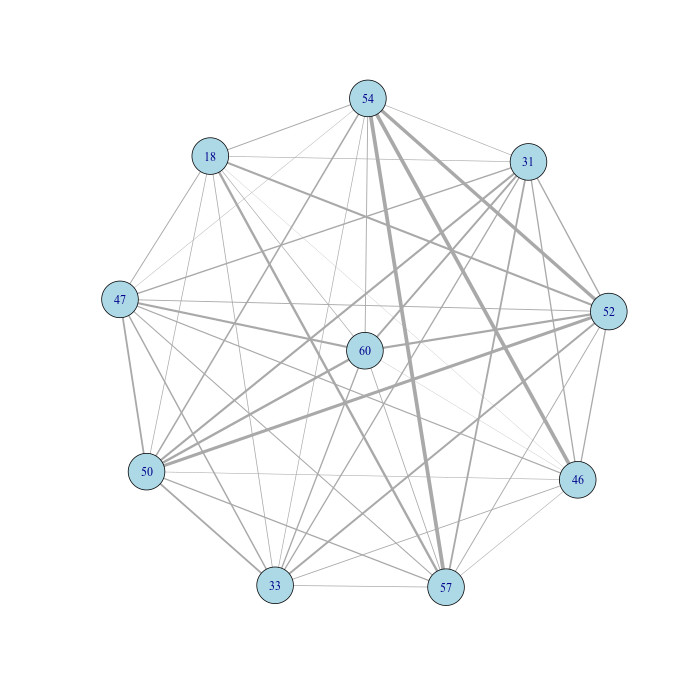

```{r setup, include=FALSE}
knitr::opts_chunk$set(echo = TRUE)
```

# Introduction 

gplas is a tool to bin plasmid-predicted contigs based on sequence composition, coverage and assembly graph information. Gplas is a new tool that extends the possibility of accurately binning predicted plasmid contigs into several discrete plasmid components. 

```{r, echo = FALSE}
knitr::include_graphics("figures/logo.png")
```

# Installation 

```{bash, eval = FALSE}
git clone https://gitlab.com/sirarredondo/gplas.git
cd gplas
./gplas.sh -i test/faecium_graph.gfa -c mlplasmids -s 'Enterococcus faecium' -n 'installation'
```

First-time installation can take some time depending on your internet speed (~20 minutes). 

The good news is that you do not have to install any dependencies. The snakemake pipeline and different conda environments integrate all the dependencies required to run gplas.  

After the first-time installation, you will get the prediction of gplas in a few minutes and using a single thread! 

Gplas first checks if the following tools are present on your system:

1. [Conda](https://bioconda.github.io/) 

2. [Snakemake](https://snakemake.readthedocs.io/en/stable/) version 5.5.4


After this, gplas will start the snakemake pipeline and will install different conda environments with the following R packages:

  &nbsp;&nbsp;&nbsp;&nbsp;&nbsp;&nbsp; [igraph](https://cran.r-project.org/web/packages/igraph/index.html) version 1.2.4.1
  
  &nbsp;&nbsp;&nbsp;&nbsp;&nbsp;&nbsp; [ggraph](https://cran.r-project.org/web/packages/ggraph/index.html) version 1.0.2
  
  &nbsp;&nbsp;&nbsp;&nbsp;&nbsp;&nbsp; [Biostrings](https://www.bioconductor.org/packages/release/bioc/html/Biostrings.html) version 2.50.2
  
  &nbsp;&nbsp;&nbsp;&nbsp;&nbsp;&nbsp; [seqinr](https://cran.r-project.org/web/packages/seqinr/index.html) version 3.4-5
  
  &nbsp;&nbsp;&nbsp;&nbsp;&nbsp;&nbsp; [tidyverse](https://www.tidyverse.org/) version 1.2.1 
  
  &nbsp;&nbsp;&nbsp;&nbsp;&nbsp;&nbsp; [spatstat](https://cran.r-project.org/web/packages/spatstat/index.html) version 1.59-0
  
  &nbsp;&nbsp;&nbsp;&nbsp;&nbsp;&nbsp; [mcl](https://cran.r-project.org/web/packages/MCL/index.html) version 1.0
  
  &nbsp;&nbsp;&nbsp;&nbsp;&nbsp;&nbsp; [ggrepel](https://cran.r-project.org/web/packages/ggrepel/index.html) version 0.8.0 

Following this, it will install the tools that we use to predict plasmid-derived contigs. 

4. [mlplasmids](https://gitlab.com/sirarredondo/mlplasmids) version 1.0.0 

5. [plasflow](https://anaconda.org/bioconda/plasflow) version 1.1


# Usage 

## Quick usage 

### Running gplas with an assembly graph 

Gplas only requires a single argument **'-i'** corresponding to an assembly graph in gfa format. Such an assembly graph can be obtained with [SPAdes genome assembler](https://github.com/ablab/spades).
You need to specify which classifier gplas is going to use, mlplasmids or plasflow, with the argument **'-c'**

If you choose mlplasmids for the prediction, there is an additional mandatory argument **'-s'** in which you need to list any of the following three bacterial species:

- 'Enterococcus faecium'
- 'Klebsiella pneumoniae'
- 'Escherichia coli'

You can use plasflow as a classifier if you have a different bacterial species. 

```{bash, eval = TRUE}
./gplas.sh -i test/faecium_graph.gfa -c mlplasmids -s 'Enterococcus faecium' -n 'my_isolate'
```


## Main output files 

Gplas will create a folder called 'results' with the following files: 

```{bash}
ls results/my_isolate*
```

### results/*results.tab 

Tab delimited file containing the prediction given by mlplasmids or plasflow together with the bin prediction by gplas. 
The file contains the following information: contig number, probability of being chromosome-derived, probability of being plasmid-derived, class prediction, 
contig name, k-mer coverage, length, bin assigned. 

```{r, echo = FALSE}
results <- read.table(file = 'results/my_isolate_results.tab', header = TRUE)
knitr::kable(results)
```

### results/*components.tab

Tab delimited file containing the bin prediction reported by gplas with the following information: contig number, bin assignation  

```{r, echo = FALSE}
components <- read.table(file = 'results/my_isolate_bins.tab', header = TRUE)

knitr::kable(components)
```

### results/*plasmidome_network.png

Png file of the plasmidome network generated by gplas after creating an undirected graph using the significant co-occurrence links corresponding to plasmid starting nodes. 

```{r, echo=FALSE}

```

### results/*components.fasta

Fasta files with the nodes belonging to each predicted component. 

```{bash}
grep '>' results/my_isolate*.fasta
```

### walks/*solutions.csv

gplas generates plasmid-like paths per each plasmid starting node. These paths are used later to construct the co-occurrence networks but they can also be useful to observe all the different paths starting from a single node. 
These paths can be directly given to Bandage to visualize and manually inspect a path. 

In this case, we find different possible plasmid paths starting from the node 18+. T
hese paths may contain inversions and rearrangements since repeats units such as transposases which can be present several times in the same plasmid sequence. 
In these cases, gplas can traverse the sequence in different ways generating different plasmid-like paths. 

```{bash}
head -n 10 walks/my_isolate_solutions.csv
```

For example, we can inspect in Bandage the path: 18+,76-,52+,94+,57-,77+,18+ 

This path forms a circular sequence since there is overlap between the initial and end node of the path. 

```{r, echo=FALSE}
knitr::include_graphics("figures/bandage_path.jpg")
```


## Complete usage 

Gplas can take the following arguments:

Mandatory arguments: 

- **-i**: Path to the graph file in *.gfa format used to extract nodes and links. Gfa file format
- **-c**: Classifier used to predict the contigs extracted from the input graph. String value: 'plasflow' or 'mlplasmids'
- **-s**: Only applicable if mlplasmids is chosen. Bacterial species from the graph file. If you have specified mlplasmids as classifier you need to provide one of the following three bacterial species: 'Enterococcus faecium','Klebsiella pneumoniae' or 'Escherichia coli'

Optional arguments:

- **-n**: Project name given to gplas. Default: 'unnamed'
- **-t**: Threshold to predict plasmid-derived sequences. Integer value ranging from 0 to 1. Default mlplasmids threshold: 0.5 Default plasflow threshold: 0.7
- **-x**: Number of times gplas finds plasmid paths per each plasmid starting node. Integer value ranging from 1 to infinite. Default: 20
- **-f**: Gplas filtering threshold score to reject possible outcoming edges. Integer value ranging from 0 to 1. Default: 0.1

For benchmarking purposes you can pass a complete genome to gplas and will generate a precision and completeness. Using this you can assess the performance of gplas on a small set of genomes in which perhaps you have generated long-reads. 

- **-r**: Path to the complete reference genome corresponding to the graph given. For optimal results using this benchmarking flag, please name the reference genomes using the Unicycler scheme: e.g. '1 length=4123456' '2 length=10000' '3 length=2000' for your chromosome and plasmids. Fasta file format
Fasta file format

# Help page 

```{bash}
./gplas.sh -h
```


# Issues/Bugs 

You can report any issues or bugs that you find while installing/running gplas using the [issue tracker](https://gitlab.com/sirarredondo/gplas/issues)

