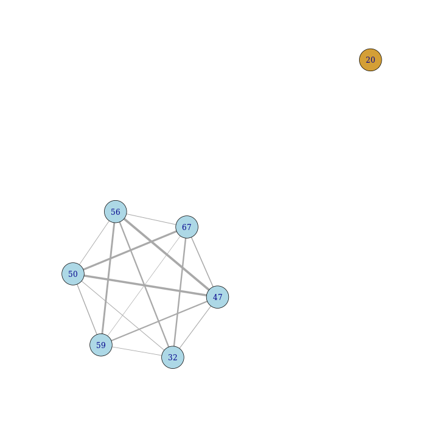

gplas: binning plasmid-predicted contigs
================

<div align="center"></div>

gplas is a tool to bin plasmid-predicted contigs based on sequence
composition, coverage and assembly graph information. Gplas is a new
tool that extends the possibility of accurately binning predicted
plasmid contigs into several discrete plasmid components.

# Table of Contents
- [gplas: binning plasmid-predicted contigs](#gplas-binning-plasmid-predicted-contigs)
- [Table of Contents](#table-of-contents)
- [Installation](#installation)
  - [Installation using conda (to be implemented)](#installation-using-conda-to-be-implemented)
  - [Installation using pip and conda](#installation-using-pip-and-conda)
  - [Installation using source code](#installation-using-source-code)
- [Quick usage](#quick-usage)
    - [Running gplas with an assembly graph](#running-gplas-with-an-assembly-graph)
    - [Running gplas coupled to a different binary classifier](#running-gplas-coupled-to-a-different-binary-classifier)
    - [New model for A. baumannii](#new-model-for-a-baumannii)
    - [Main output files](#main-output-files)
        - [results/\*results.tab](#resultsresultstab)
        - [results/\*components.tab](#resultscomponentstab)
        - [results/\*plasmidome\_network.png](#resultsplasmidome_networkpng)
        - [results/\*components.fasta](#resultscomponentsfasta)
- [Complete usage](#complete-usage)
    - [Intermediary results files](#intermediary-results-files)
        - [walks/normal_mode/\*solutions.csv](#walksnormal_modesolutionscsv)
- [Help page](#help-page)
- [Issues and Bugs](#issues-and-bugs)

# Installation

## Installation using conda (to be implemented)

## Installation using pip and conda

While the conda recipe is under construction, the prefered way of installing gplas is using pip and a conda environment. Please follow the instructions below:

Clone the repository and enter the directory
``` bash
git clone https://gitlab.com/mmb-umcu/gplas.git
cd gplas
```
Create a new conda environment and activate it:
``` bash
conda env create --name gplas --file envs/gplas.yaml
conda activate gplas
```

Install gplas using pip
``` bash
pip install -e .
```
When this has finished, test the installation using 
``` bash
python -m gplas.gplas -i test/faecium_graph.gfa -c mlplasmids -s 'Enterococcus faecium' -n 'installation'
```

## Installation using source code
``` bash
git clone https://gitlab.com/mmb-umcu/gplas.git
cd gplas/gplas
python gplas.py -i test/faecium_graph.gfa -c mlplasmids -s 'Enterococcus faecium' -n 'installation'
```

First-time installation can take some time depending on your internet
speed (\~20 minutes).

# Quick usage

### Running gplas with an assembly graph

Gplas only requires a single argument **‘-i’** corresponding to an
assembly graph in gfa format. Such an assembly graph can be obtained
with [SPAdes genome assembler](https://github.com/ablab/spades) or with [Unicycler](https://github.com/rrwick/Unicycler). You
need to specify which classifier gplas is going to use with the argument **‘-c’**
Out of the box, gplas uses 'mlplasmids' or 'plasflow' as classifiers, but other tools can also be used with the 'extract' and 'predict' arguments.

If you choose mlplasmids for the prediction, there is an additional
mandatory argument **‘-s’** in which you need to list any of the
following bacterial species:

-   ‘Enterococcus faecium’
-   ‘Klebsiella pneumoniae’
-   ‘Acinetobacter baumannii’
-   ‘Escherichia coli’

``` bash
python -m gplas.gplas -i test/faecium_graph.gfa -c mlplasmids -s 'Enterococcus faecium' -n 'my_isolate'
```

You can use plasflow as a classifier if you have a different bacterial
species.

``` bash
python -m gplas.gplas -i test/faecium_graph.gfa -c plasflow -s 'Other species' -n 'my_isolate'
```

### Running gplas coupled to a different binary classifier 

For using other binary classifiers, three steps must be followed:
1) The classifier argument must be set to 'extract'.

This will generate a fasta file containing the extracted nodes sequences, which will be saved to **gplas_input/my_isolate_raw_nodes.fasta**.

``` bash
python -m gplas.gplas -i test/faecium_graph.gfa -c extract -n 'my_isolate'
```
2) Extracted nodes will be used as input for the binary classifier selected by the user. 
After binary classifcation, predictions will need to be formated appropriately (see below) and saved to **independent_prediction/my_isolate_plasmid_prediction.tab**. Keep in mind that the name set with `-n 'my_isolate` must be kept as a prefix for this last file.

The output from the selected binary classification tools has to be formatted to a tab separated file containing the following columns and headers:

| Prob\_Chromosome | Prob\_Plasmid |  Prediction  | Contig\_name                             | Contig\_length|
|-----------------:|--------------:|:-------------|:-----------------------------------------|--------------:|
|       0.40       |      0.60     |    Plasmid   |  S1\_LN:i:4240\_dp:f:1.936810327946946   |      4240     |
|       0.65       |      0.35     |  Chromosome  | S18\_LN:i:147394\_dp:f:1.05847808445255  |     147394    |
|       0.12       |      0.88     |  Chromosome  |  S25\_LN:i:7135\_dp:f:2.03512069877433   |      7135     |

Currently, [plasmidEC](https://github.com/lisavader/plasmidEC) provides the option to automatically generate results for *E. coli* in a format compatible with gplas.

3) To complete the plasmid predictions, we will run gplas again setting the classifier argument to 'predict'.

``` bash
python -m gplas.gplas -i test/faecium_graph.gfa -c predict -n 'my_isolate'
```
### New model for A. baumannii

Thanks to the brilliant work from Alessia Carrara and Julian Paganini,
we developed a new model for mlplasmids and integrated it into gplas. To
use the model, please run:

``` bash
python -m gplas.gplas -i test/abaumannii_graph.gfa -c mlplasmids -s 'Acinetobacter baumannii' -n 'ab_test' -t 0.7
```

### Main output files

Gplas will create a folder called ‘results’ with the following files:

``` bash
ls results/my_isolate*
```

    ## results/my_isolate_bin_1.fasta
    ## results/my_isolate_bins.tab
    ## results/my_isolate_plasmidome_network.png
    ## results/my_isolate_results.tab

##### results/\*results.tab

Tab delimited file containing the prediction given by mlplasmids or
plasflow together with the bin prediction by gplas. The file contains
the following information: contig number, probability of being
chromosome-derived, probability of being plasmid-derived, class
prediction, contig name, k-mer coverage, length, bin assigned.

| number | Contig\_name                             | Prob\_Chromosome | Prob\_Plasmid | Prediction | length | coverage | Bin |
|-------:|:-----------------------------------------|-----------------:|--------------:|:-----------|-------:|---------:|----:|
|     18 | S18\_LN:i:54155\_dp:f:1.0514645940835776 |             0.01 |          0.99 | Plasmid    |  54155 |     1.05 |   1 |
|     31 | S31\_LN:i:21202\_dp:f:1.194722937126809  |             0.15 |          0.85 | Plasmid    |  21202 |     1.19 |   1 |
|     33 | S33\_LN:i:18202\_dp:f:1.1628830074648842 |             0.40 |          0.60 | Plasmid    |  18202 |     1.16 |   1 |
|     46 | S46\_LN:i:8487\_dp:f:1.2210058174026983  |             0.03 |          0.97 | Plasmid    |   8487 |     1.22 |   1 |
|     47 | S47\_LN:i:8177\_dp:f:0.9996798934685464  |             0.04 |          0.96 | Plasmid    |   8177 |     1.00 |   1 |
|     50 | S50\_LN:i:4993\_dp:f:1.1698997426343487  |             0.02 |          0.98 | Plasmid    |   4993 |     1.17 |   1 |
|     52 | S52\_LN:i:4014\_dp:f:0.9783821389091624  |             0.03 |          0.97 | Plasmid    |   4014 |     0.98 |   1 |
|     54 | S54\_LN:i:3077\_dp:f:1.1553028848000615  |             0.08 |          0.92 | Plasmid    |   3077 |     1.16 |   1 |
|     57 | S57\_LN:i:2626\_dp:f:0.9929149754371588  |             0.03 |          0.97 | Plasmid    |   2626 |     0.99 |   1 |
|     60 | S60\_LN:i:1589\_dp:f:1.0577429501871556  |             0.00 |          1.00 | Plasmid    |   1589 |     1.06 |   1 |

##### results/\*components.tab

Tab delimited file containing the bin prediction reported by gplas with
the following information: contig number, bin assignation

| number | Bin |
|-------:|----:|
|     18 |   1 |
|     33 |   1 |
|     31 |   1 |
|     47 |   1 |
|     46 |   1 |
|     50 |   1 |
|     52 |   1 |
|     57 |   1 |
|     54 |   1 |
|     60 |   1 |

##### results/\*plasmidome\_network.png

Png file of the plasmidome network generated by gplas after creating an
undirected graph from edges between plasmid unitigs co-existing in the
walks created by gplas.

<!-- -->

##### results/\*components.fasta

Fasta files with the nodes belonging to each predicted component.

``` bash
grep '>' results/my_isolate*.fasta
```

    ## >S18_LN:i:54155_dp:f:1.0514645940835776
    ## >S31_LN:i:21202_dp:f:1.194722937126809
    ## >S33_LN:i:18202_dp:f:1.1628830074648842
    ## >S46_LN:i:8487_dp:f:1.2210058174026983
    ## >S47_LN:i:8177_dp:f:0.9996798934685464
    ## >S50_LN:i:4993_dp:f:1.1698997426343487
    ## >S52_LN:i:4014_dp:f:0.9783821389091624
    ## >S54_LN:i:3077_dp:f:1.1553028848000615
    ## >S57_LN:i:2626_dp:f:0.9929149754371588
    ## >S60_LN:i:1589_dp:f:1.0577429501871556


# Complete usage

Gplas can take the following arguments:

Mandatory arguments:

-   **-i**: Path to the graph file in \*.gfa format used to extract
    nodes and links. Gfa file format
-   **-c**: Classifier used to predict the contigs extracted from the
    input graph. String value: ‘plasflow’, ‘mlplasmids’, 'extract' or 'predict'.
-   **-s**: Only applicable if mlplasmids is chosen. Bacterial species
    from the graph file. If you have specified mlplasmids as classifier
    you need to provide one of the following bacterial species:
    ‘Enterococcus faecium’,‘Klebsiella pneumoniae’, ‘Acinetobacter
    baumannii’ or ‘Escherichia coli’

Optional arguments:

-   **-n**: Project name given to gplas. Default: ‘unnamed’
-   **-t**: Threshold to predict plasmid-derived sequences. Integer
    value ranging from 0 to 1. Default mlplasmids threshold: 0.5 Default
    plasflow threshold: 0.7
-   **-x**: Number of times gplas finds plasmid paths per each plasmid
    starting node. Integer value ranging from 1 to infinite. Default: 20
-   **-f**: Gplas filtering threshold score to reject possible outcoming
    edges. Integer value ranging from 0 to 1. Default: 0.1
-   **-q**: Modularity threshold to split components present in the
    plasmidome network. Integer value ranging from 0 to 1. Default: 0.2
-   **-b**: Coverage variance allowed for bold walks to recover unbinned plasmid-predicted unitigs. 
    Numeric value: X times coverage variance of the chromsome. Default: 5
-   **-l**: Threshold for filtering sequences based on minimum length. Default: 1000
-   **-k**: Keep intermediary files.

### Intermediary results files

If the **-k** flag is selected, gplas will also **keep** all intermediary files needed to construct the plasmid predictions. For example:

##### walks/normal_mode/\*solutions.csv

gplas generates plasmid-like walks per each plasmid starting node. These
paths are used later to generate the edges from the plasmidome network
but they can also be useful to observe all the different walks starting
from a single node (plasmid unitig). These walk can be directly given to
Bandage to visualize and manually inspect a walk.

In this case, we find different possible plasmid walks starting from the
node 18+. These paths may contain inversions and rearrangements since
repeats units such as transposases which can be present several times in
the same plasmid sequence. In these cases, gplas can traverse the
sequence in different ways generating different plasmid-like paths.

``` bash
head -n 10 walks/normal_mode/my_isolate_solutions.csv
```

    ## 18+,76-,102+,33+,76-,102+,92+,47+,115-,64+,31-,79+,60-,70-,50+,64-,116+,61-,88-,89+,69-,96-,119+,64-,116+,61-,88-,90+,69-,100+,119+,64-,116+,63+,115-,64+,119-,100-,69+
    ## 18+,76-,52+,94+,57-,77+,18+
    ## 18+,76-,52+,94+,57-,77+,87-,65+,54-,94+
    ## 18+,76-,52+,94+,57-,77+,87-,65+,54-,94+
    ## 18+,76-,52+,94+,57-,77+,87-,65+,54-,94+
    ## 18+,76-,102+,33+,76-,52+,94+,57-,77+,18+
    ## 18+,76-,52+,94+,57-,77+,18+
    ## 18+,76-,102+,92+,47+,115-,64+,31-,79+,60-,70-,50+,64-,113+
    ## 18+,76-,52+,94+,57-,77+,18+
    ## 18+,76-,102+,92+,47+,115-,64+,31-,79+,46-,79+,60-,70-,50+,64-,114+

For example, we can inspect in Bandage the path:
18+,76-,52+,94+,57-,77+,18+

This path forms a circular sequence since there is overlap between the
initial and end node of the path.

<!-- -->


# Help page

``` bash
python -m gplas.gplas -h
```
    _______ .______    __           ___           _______.
    /  _____||   _  \  |  |         /   \         /       |
    |  |  __  |  |_)  | |  |        /  ^  \       |   (----`
    |  | |_ | |   ___/  |  |       /  /_\  \       \   \    
    |  |__| | |  |      |  `----. /  _____  \  .----)   |   
    \______| | _|      |_______|/__/     \__\ |_______/    

    Welcome to the user guide of gplas (version 1.0.0).

    BASIC USAGE
    python -m gplas.gplas [-i <file>] [-c <string>] [-s <string>] [...]

    Example:
    python -m gplas.gplas -i mygraph.gfa -c mlplasmids -s 'Enterococcus faecium'

    USER OPTIONS
    Input:
    -i  [MANDATORY] Path to the graph file in GFA (.gfa) format, used to extract nodes and links. 
    -c  [MANDATORY] Classifier used to predict the contigs extracted from the input graph.
        String value: 'plasflow', 'mlplasmids', 'extract' or 'predict'.
        Values 'extract' and 'predict' are used in the case of external binary classifiers, according to the steps:
            1) Classifier option must be set to 'extract'. This will generate a fasta file containing the extracted nodes
            sequences, which will be saved to gplas_input/${name}_raw_nodes.fasta.
            2) Extracted nodes will be used as input for the binary classification tool selected by the user.
            After binary classifcation, predictions will need to be formated appropriately and saved to
            independent_prediction/${name}_plasmid_prediction.tab.
            3) Classifier option must be set to 'predict'
    -s  [Optional; MANDATORY for 'mlplasmids' classifier] Bacterial species from the graph file.
        If you have specified mlplasmids as classifier you need to provide one of the following three bacterial species:
        'Enterococcus faecium', 'Enterococcus faecalis', 'Klebsiella pneumoniae', 'Acinetobacter baumannii' or
        'Escherichia coli'.

    Output:
    -n  [Optional] Output name used in the files generated by gplas. Default: 'unnamed'.
    -k  [Optional] Keeps intermediary files (i.e. plasmid-walks).

    Parameters:
    -t  [Optional] Threshold to predict plasmid-derived sequences. Integer value ranging from 0 to 1. 
        Only valid for classifier options 'plasflow' (default: 0.5) and 'mlplasmids' (default: 0.7).
    -b  [Optional] Coverage variance allowed for bold walks to recover unbinned plasmid-predicted nodes.
        Numeric value: X times coverage variance of the chromsome. Default: 5
    -x  [Optional] Number of times gplas finds plasmid walks per each plasmid starting node.
        Integer value ranging from 1 to infinite. Default: 20
    -f  [Optional] Gplas filtering threshold score to reject possible outcoming edges.
        Integer value ranging from 0 to 1. Default: 0.1
    -q  [Optional] Modularity threshold to split components present in the plasmidome network.
        Integer value ranging from 0 to 1. Default: 0.2
    -l  [Optional] Filter threshold for minimum length of sequences to be considered.
        Integer value ranging from 0 to infinite. Default: 1000

    Other:
    -h  Print this help message.
    -v  Print gplas version.

# Issues and Bugs

You can report any issues or bugs that you find while installing/running
gplas using the [issue tracker](https://gitlab.com/sirarredondo/gplas/issues).
