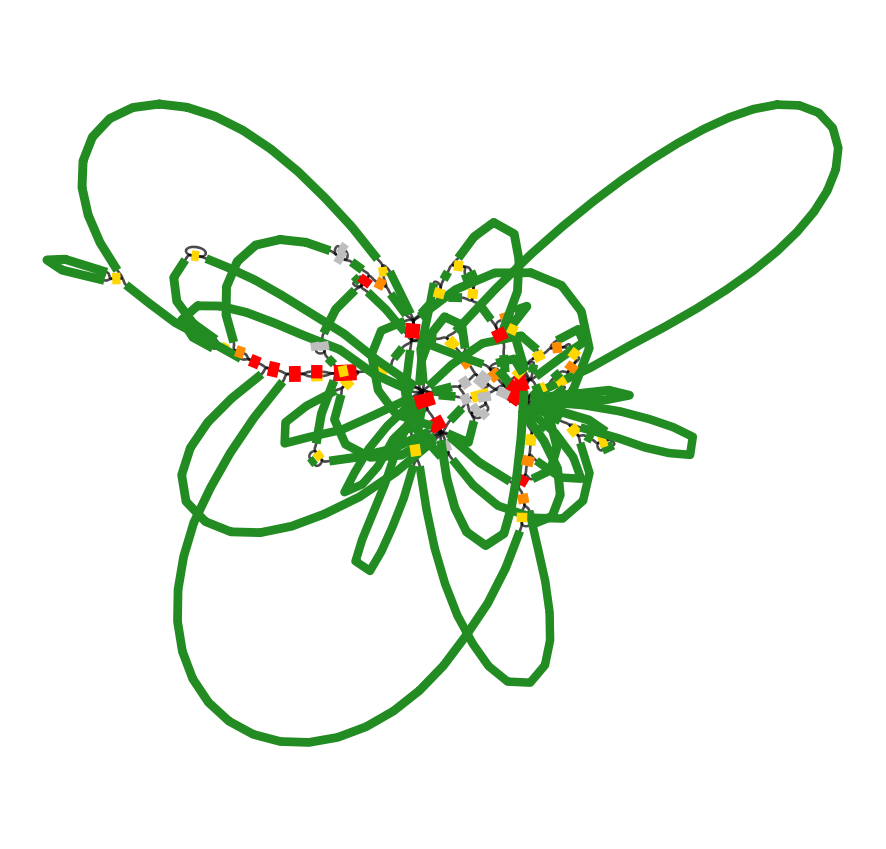
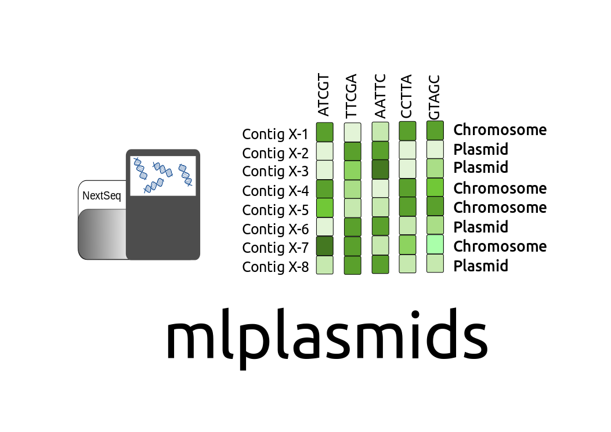
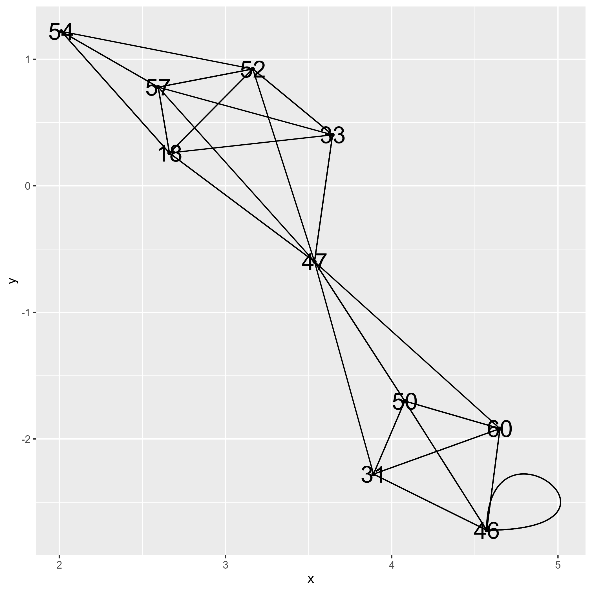

gplas: binning plasmid-predicted contigs
================

# Introduction

gplas is a tool to bin plasmid-predicted contigs using co-occurence
networks. Gplas is a new implementation of mlplasmids which adds the
possibility of accurately binning predicted plasmid contigs into several
independent components. We rely on the structure of the assembly graph
and k-mer information to create a new plasmidome network and predict
plasmid contigs belonging to different genomic units.

<!-- -->

# Installation

``` bash
git clone https://gitlab.com/sirarredondo/gplas.git
cd gplas
./gplas.sh -i test/faecium_graph.gfa
```

First-time installation can take some time depending on your internet
speed. But\! You do not have to worry about installing any dependencies
or running the pipeline by yourself. Thanks to conda and snakemake, we
integrated all the dependencies required to run gplas in different conda
environments depending on the part of the pipeline.

After the first-time installation, you will get the prediction of gplas
in a few minutes and using a single thread.

Gplas will check if the following tools are present in your system:

1.  [Conda](https://bioconda.github.io/)

2.  [Snakemake](https://snakemake.readthedocs.io/en/stable/)

After this, gplas will start the snakemake pipeline and will install
different conda environments with the following R packages:

      
[igraph](https://cran.r-project.org/web/packages/igraph/index.html)
version 1.2.4.1

      
[ggraph](https://cran.r-project.org/web/packages/ggraph/index.html)
version 1.0.2

      
[Biostrings](https://www.bioconductor.org/packages/release/bioc/html/Biostrings.html)
version 2.50.2

      
[seqinr](https://cran.r-project.org/web/packages/seqinr/index.html)
version 3.4-5

       [tidyverse](https://www.tidyverse.org/) version 1.2.1

      
[spatstat](https://cran.r-project.org/web/packages/spatstat/index.html)
version 1.59-0

      
[cooccur](https://cran.r-project.org/web/packages/cooccur/index.html)
version 1.3

      
[ggrepel](https://cran.r-project.org/web/packages/ggrepel/index.html)
version 0.8.0

Following this, it will install the tools that we use to predict
plasmid-derived contigs.

4.  [mlplasmids](https://gitlab.com/sirarredondo/mlplasmids) version
    1.0.0

5.  [plasflow](https://anaconda.org/bioconda/plasflow) version 1.1

# Usage

## Quick usage

### Running gplas just providing the assembly graph

Gplas only requires a single argument **‘-i’** corresponding to an
assembly graph in gfa format.

<!-- -->

``` bash
./gplas.sh -i test/faecium_graph.gfa
```

## Complete usage

Gplas can take the following arguments:

Mandatory arguments:

  - **-i**: Path to the graph file in \*.gfa format used to extract
    nodes and links. Gfa file format

Optional arguments:

  - **-n**: Project name given to gplas. Default: ‘unnamed’
  - **-s**: Bacterial species from the graph file. If bacterial species
    corresponds to: ‘Enterococcus faecium’,‘Klebsiella pneumoniae’ or
    ‘Escherichia coli’ then prediction will be perfomed using
    mlplasmids. Default: ‘unknown’
  - **-t**: Threshold to predict plasmid-derived sequences. Integer
    value ranging from 0 to 1. Default: 0.5
  - **-x**: Number of times gplas finds plasmid paths per each plasmid
    starting node. Integer value ranging from 1 to infinite. Default: 10
  - **-f**: Gplas filtering threshold score to reject possible outcoming
    edges. Integer value ranging from 0 to 1. Default: 0.1

For benchmarking purposes you can pass a complete genome to gplas and
will generate a precision and completeness. Using this you can assess
the performance of gplas on a small set of genomes in which perhaps you
have generated long-reads.

  - **-r**: Path to the complete reference genome corresponding to the
    graph given. Fasta file format

For example, if we want to use mlplasmids with the *Enterococcus
faecium* model on the same test set we only need to specify the
following:

<!-- -->

``` bash
./gplas.sh -i test/faecium_graph.gfa -n 'using_mlplasmids' -s 'Enterococcus faecium'
```

# Help page

``` bash
./gplas.sh -h
```

    ##   _______ .______    __           ___           _______.
    ##  /  _____||   _  \  |  |         /   \         /       |
    ## |  |  __  |  |_)  | |  |        /  ^  \       |   (----`
    ## |  | |_ | |   ___/  |  |       /  /_\  \       \   \    
    ## |  |__| | |  |      |  `----. /  _____  \  .----)   |   
    ##  \______| | _|      |_______|/__/     \__\ |_______/    
    ## Welcome to the user guide of gplas:
    ## 
    ## Basic usage: ./gplas.sh -i mygraph.gfa
    ## 
    ## Input:
    ##       -i      Mandatory: Path to the graph file in *.gfa format used to extract nodes and links. Gfa file format
    ## Projectname/Output:
    ##       -n      Optional: Project name given to gplas. Default: 'unnamed'
    ## Settings: 
    ##       -s      Optional: Bacterial species from the graph file. If bacterial species corresponds to:
    ##                 'Enterococcus faecium','Klebsiella pneumoniae' or 'Escherichia coli' then prediction will be perfomed using mlplasmids.
    ##                  Default: 'unknown'
    ##   -t      Optional: Threshold to predict plasmid-derived sequences. Integer value ranging from 0 to 1. Default: 0.5
    ##   -x      Optional: Number of times gplas finds plasmid paths per each plasmid starting node. Integer value ranging from 1 to infinite.
    ##                  Default: 10
    ##   -f      Optional: Gplas filtering threshold score to reject possible outcoming edges. Integer value ranging from 0 to 1. Default: 0.1
    ## Benchmarking purposes: 
    ##       -r      Optional: Path to the complete reference genome corresponding to the graph given. Fasta file format

# Main output files

Gplas will create a folder called ‘results’ with the following files:

``` bash
ls results/using_mlplasmids*
```

    ## results/using_mlplasmids_component_1.fasta
    ## results/using_mlplasmids_components.tab
    ## results/using_mlplasmids_plasmidome_network.png
    ## results/using_mlplasmids_results.tab

## results/

### results/\*results.tab

Tab delimited file containing the prediction given by mlplasmids or
plasflow together with the bin prediction assigned by gplas. The file
contains the following information: contig number, probability of being
chromosome-derived, probability of being plasmid-derived, class
prediction, contig name, k-mer coverage, length, component
assigned.

| number | Prob\_Chromosome | Prob\_Plasmid | Prediction | Contig\_name                             | coverage | length | Component |
| -----: | ---------------: | ------------: | :--------- | :--------------------------------------- | -------: | -----: | --------: |
|     18 |             0.01 |          0.99 | Plasmid    | S18\_LN:i:54155\_dp:f:1.0514645940835776 |     1.05 |  54155 |         1 |
|     31 |             0.15 |          0.85 | Plasmid    | S31\_LN:i:21202\_dp:f:1.194722937126809  |     1.19 |  21202 |         1 |
|     33 |             0.40 |          0.60 | Plasmid    | S33\_LN:i:18202\_dp:f:1.1628830074648842 |     1.16 |  18202 |         1 |
|     46 |             0.03 |          0.97 | Plasmid    | S46\_LN:i:8487\_dp:f:1.2210058174026983  |     1.22 |   8487 |         1 |
|     47 |             0.04 |          0.96 | Plasmid    | S47\_LN:i:8177\_dp:f:0.9996798934685464  |     1.00 |   8177 |         1 |
|     50 |             0.02 |          0.98 | Plasmid    | S50\_LN:i:4993\_dp:f:1.1698997426343487  |     1.17 |   4993 |         1 |
|     52 |             0.03 |          0.97 | Plasmid    | S52\_LN:i:4014\_dp:f:0.9783821389091624  |     0.98 |   4014 |         1 |
|     54 |             0.08 |          0.92 | Plasmid    | S54\_LN:i:3077\_dp:f:1.1553028848000615  |     1.16 |   3077 |         1 |
|     57 |             0.03 |          0.97 | Plasmid    | S57\_LN:i:2626\_dp:f:0.9929149754371588  |     0.99 |   2626 |         1 |
|     60 |             0.00 |          1.00 | Plasmid    | S60\_LN:i:1589\_dp:f:1.0577429501871556  |     1.06 |   1589 |         1 |

### results/\*components.tab

Tab delimited file containing the bin prediction reported by gplas with
the following information: contig number, component assignation

| number | Component |
| -----: | --------: |
|     18 |         1 |
|     33 |         1 |
|     47 |         1 |
|     31 |         1 |
|     60 |         1 |
|     50 |         1 |
|     52 |         1 |
|     57 |         1 |
|     46 |         1 |
|     54 |         1 |

### results/\*plasmidome\_network.png

Png file of the plasmidome network generated by gplas after creating an
undirected graph using the significant co-occurrence links corresponding
to plasmid starting nodes.

<!-- -->

### results/\*components.fasta

Fasta files with the nodes belonging to each predicted component.

``` bash
grep '>' results/using_mlplasmids*.fasta
```

    ## >S18_LN:i:54155_dp:f:1.0514645940835776
    ## >S31_LN:i:21202_dp:f:1.194722937126809
    ## >S33_LN:i:18202_dp:f:1.1628830074648842
    ## >S46_LN:i:8487_dp:f:1.2210058174026983
    ## >S47_LN:i:8177_dp:f:0.9996798934685464
    ## >S50_LN:i:4993_dp:f:1.1698997426343487
    ## >S52_LN:i:4014_dp:f:0.9783821389091624
    ## >S54_LN:i:3077_dp:f:1.1553028848000615
    ## >S57_LN:i:2626_dp:f:0.9929149754371588
    ## >S60_LN:i:1589_dp:f:1.0577429501871556

## paths/

### paths/\*solutions.csv

gplas generates plasmid-like paths per each plasmid starting node. These
paths are used later on to construct the co-occurrence networks but they
can also be useful to observe all the different paths starting from a
single node. These paths can be directly given to Bandage to visualize
and manually inspect a path.

In this case, we find different possible plasmid paths starting from the
node 18+. These paths may contain inversions and rearrangements since
repeats units such as transposases can be present several times in the
same plasmid sequence. In these cases, gplas can traverse the sequence
in different ways generating different plasmid-like
    paths.

``` bash
head -n 10 paths/using_mlplasmids_solutions.csv
```

    ## 18+,76-,102+,33+,76-,102+,92+,47+,115-,64+,31-,79+,60-,70-,50+,64-,116+,63+
    ## 18+,76-,52+,94+,71-,77+,18+
    ## 18+,76-,52+,94+,57-,77+,18+
    ## 18+,76-,102+,92+,47+,115-,64+,99+,107-,91+,83+,80-,95-
    ## 18+,76-,52+,94+,57-,77+,18+
    ## 18+,76-,52+,94+,57-,77+,87-,65+,54-,94+
    ## 18+,76-,102+,92+,47+,115-,64+,31-,79+,46-,79+,60-,70-,50+,64-,115+,63-,116-,64+,119-
    ## 18+,76-,52+,94+,57-,77+,18+
    ## 18+,76-,52+,94+,57-,77+,87-,65+,54-,94+
    ## 18+,76-,52+,94+,57-,77+,18+

For example, we can inspect in Bandage the path:
18+,76-,52+,94+,57-,77+,18+

This path forms a circular sequence since there is overlap between the
initial and end node of the path.

<!-- -->

# Issues/Bugs

You can report any issues or bugs that you find while installing/running
gplas using the issue tracker
