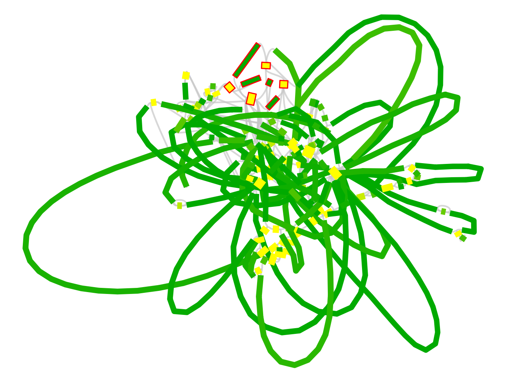

gplas: binning plasmid-predicted contigs
================

# Introduction

gplas is a tool to bin plasmid-predicted contigs based on sequence
composition, coverage and assembly graph information. Gplas is a new
tool that extends the possibility of accurately binning predicted
plasmid contigs into several discrete plasmid components.

<!-- -->

# Installation

``` bash
git clone https://gitlab.com/sirarredondo/gplas.git
cd gplas
./gplas.sh -i test/faecium_graph.gfa -c mlplasmids -s 'Enterococcus faecium' -n 'installation'
```

First-time installation can take some time depending on your internet
speed (~20 minutes).

The good news is that you do not have to install any dependencies. The
snakemake pipeline and different conda environments integrate all the
dependencies required to run gplas.

After the first-time installation, you will get the prediction of gplas
in a few minutes and using a single thread\!

Gplas first checks if the following tools are present on your system:

1.  [Conda](https://bioconda.github.io/)

2.  [Snakemake](https://snakemake.readthedocs.io/en/stable/) version
    5.5.4

After this, gplas will start the snakemake pipeline and will install
different conda environments with the following R packages:

      
[igraph](https://cran.r-project.org/web/packages/igraph/index.html)
version 1.2.4.1

      
[ggraph](https://cran.r-project.org/web/packages/ggraph/index.html)
version 1.0.2

      
[Biostrings](https://www.bioconductor.org/packages/release/bioc/html/Biostrings.html)
version 2.50.2

      
[seqinr](https://cran.r-project.org/web/packages/seqinr/index.html)
version 3.4-5

       [tidyverse](https://www.tidyverse.org/) version 1.2.1

      
[spatstat](https://cran.r-project.org/web/packages/spatstat/index.html)
version 1.59-0

       [mcl](https://cran.r-project.org/web/packages/MCL/index.html)
version 1.0

      
[ggrepel](https://cran.r-project.org/web/packages/ggrepel/index.html)
version 0.8.0

Following this, it will install the tools that we use to predict
plasmid-derived contigs.

4.  [mlplasmids](https://gitlab.com/sirarredondo/mlplasmids) version
    1.0.0

5.  [plasflow](https://anaconda.org/bioconda/plasflow) version 1.1

# Usage

## Quick usage

### Running gplas with an assembly graph

Gplas only requires a single argument **‘-i’** corresponding to an
assembly graph in gfa format. Such an assembly graph can be obtained
with [SPAdes genome assembler](https://github.com/ablab/spades). You
need to specify which classifier gplas is going to use, mlplasmids or
plasflow, with the argument **‘-c’**

If you choose mlplasmids for the prediction, there is an additional
mandatory argument **‘-s’** in which you need to list any of the
following three bacterial species:

  - ‘Enterococcus faecium’
  - ‘Klebsiella pneumoniae’
  - ‘Escherichia coli’

You can use plasflow as a classifier if you have a different bacterial
species.

``` bash
./gplas.sh -i test/faecium_graph.gfa -c mlplasmids -s 'Enterococcus faecium' -n 'usingmlplasmids'
```

    ## 
    ## 
    ##   _______ .______    __           ___           _______.
    ##  /  _____||   _  \  |  |         /   \         /       |
    ## |  |  __  |  |_)  | |  |        /  ^  \       |   (----`
    ## |  | |_ | |   ___/  |  |       /  /_\  \       \   \    
    ## |  |__| | |  |      |  `----. /  _____  \  .----)   |   
    ##  \______| | _|      |_______|/__/     \__\ |_______/    
    ## 
    ## 
    ## ##################################################################
    ## 
    ## 
    ## This is your input graph: test/faecium_graph.gfa 
    ## 
    ## This is the bacterial species that you have indicated: Enterococcus faecium 
    ## 
    ## Your results will be named  usingmlplasmids 
    ## 
    ## You did not indicate a threshold prediction. Using 0.5 because you are using mlplasmids
    ## 
    ## You did not pass the number of times to look for walks based on each plasmid seed, using 20 as default
    ## 
    ## ##################################################################
    ## Conda is present
    ## 
    ## Creating (only the first-time) a conda environment to install and run snakemake
    ## The flag 'directory' used in rule awk_parsing_alignment is only valid for outputs, not inputs.
    ## Building DAG of jobs...
    ## Unlocking working directory.
    ## The flag 'directory' used in rule awk_parsing_alignment is only valid for outputs, not inputs.
    ## Building DAG of jobs...
    ## Using shell: /bin/bash
    ## Provided cores: 1
    ## Rules claiming more threads will be scaled down.
    ## Job counts:
    ##  count   jobs
    ##  1   awk_links
    ##  1   awk_nodes
    ##  1   gplas_coocurr
    ##  1   gplas_coverage
    ##  1   gplas_paths
    ##  1   mlplasmids
    ##  6
    ## 
    ## [Mon Nov  4 11:26:54 2019]
    ## Job 1: Extracting the nodes from the graph test/faecium_graph.gfa
    ## 
    ## Activating conda environment: /home/sergi/gplas/.snakemake/conda/70552874
    ## [Mon Nov  4 11:27:17 2019]
    ## Finished job 1.
    ## 1 of 6 steps (17%) done
    ## 
    ## [Mon Nov  4 11:27:17 2019]
    ## Job 5: Extracting the links from the graph test/faecium_graph.gfa
    ## 
    ## Activating conda environment: /home/sergi/gplas/.snakemake/conda/70552874
    ## [Mon Nov  4 11:27:24 2019]
    ## Finished job 5.
    ## 2 of 6 steps (33%) done
    ## 
    ## [Mon Nov  4 11:27:24 2019]
    ## Job 3: Running mlplasmids to obtain the plasmid prediction using the nodes extracted from the graph. If this is the first time running mlplasmids, installation can take a few minutes
    ## 
    ## Activating conda environment: /home/sergi/gplas/.snakemake/conda/70552874
    ## [Mon Nov  4 11:28:01 2019]
    ## Finished job 3.
    ## 3 of 6 steps (50%) done
    ## 
    ## [Mon Nov  4 11:28:01 2019]
    ## Job 2: Extracting the sd k-mer coverage from the chromosome-predicted contigs
    ## 
    ## R script job uses conda environment but R_LIBS environment variable is set. This is likely not intended, as R_LIBS can interfere with R packages deployed via conda. Consider running `unset R_LIBS` or remove it entirely before executing Snakemake.
    ## Activating conda environment: /home/sergi/gplas/.snakemake/conda/70552874
    ## WARNING: ignoring environment value of R_HOME
    ## [Mon Nov  4 11:28:22 2019]
    ## Finished job 2.
    ## 4 of 6 steps (67%) done
    ## 
    ## [Mon Nov  4 11:28:22 2019]
    ## Job 4: Searching for plasmid-like walks using a greedy approach
    ## 
    ## R script job uses conda environment but R_LIBS environment variable is set. This is likely not intended, as R_LIBS can interfere with R packages deployed via conda. Consider running `unset R_LIBS` or remove it entirely before executing Snakemake.
    ## Activating conda environment: /home/sergi/gplas/.snakemake/conda/70552874
    ## WARNING: ignoring environment value of R_HOME
    ## [Mon Nov  4 11:29:03 2019]
    ## Finished job 4.
    ## 5 of 6 steps (83%) done
    ## 
    ## [Mon Nov  4 11:29:03 2019]
    ## Job 0: Creating a co-occurrence network and selecting significant associations between nodes.
    ## 
    ## R script job uses conda environment but R_LIBS environment variable is set. This is likely not intended, as R_LIBS can interfere with R packages deployed via conda. Consider running `unset R_LIBS` or remove it entirely before executing Snakemake.
    ## Activating conda environment: /home/sergi/gplas/.snakemake/conda/70552874
    ## WARNING: ignoring environment value of R_HOME
    ## NULL
    ## Warning message:
    ## In mapply(FUN = f, ..., SIMPLIFY = FALSE) :
    ##   longer argument not a multiple of length of shorter
    ## [Mon Nov  4 11:29:23 2019]
    ## Finished job 0.
    ## 6 of 6 steps (100%) done
    ## Complete log: /home/sergi/gplas/.snakemake/log/2019-11-04T112654.225651.snakemake.log
    ##   _______ .______    __           ___           _______.
    ##  /  _____||   _  \  |  |         /   \         /       |
    ## |  |  __  |  |_)  | |  |        /  ^  \       |   (----`
    ## |  | |_ | |   ___/  |  |       /  /_\  \       \   \    
    ## |  |__| | |  |      |  `----. /  _____  \  .----)   |   
    ##  \______| | _|      |_______|/__/     \__\ |_______/    
    ## 
    ## 
    ## Congratulations! Prediction succesfully done.
    ## 
    ## Input graph: test/faecium_graph.gfa 
    ## 
    ## Bacterial species:  'Enterococcus faecium' 
    ## 
    ## Classifier: mlplasmids 
    ## 
    ## Threshold for predicting plasmid-derived contigs: 0.5
    ## 
    ## Number of plasmid walks created per node: 20
    ## 
    ## Threshold of gplas scores: 0.1
    ## 
    ## Minimum frequency to consider an edge: 0.1
    ## 
    ## 
    ## 
    ## Your results are in results/ and walks/
    ## 
    ## We hope it helps your research, thanks for using gplas!
    ## 
    ## If you have used plasflow as a classifier please cite:
    ##   Pawel S Krawczyk et al. PlasFlow: predicting plasmid sequences in metagenomic data using genome signatures, Nucleic Acids Research, doi: 10.1093/nar/gkx1321
    ## 
    ## 
    ## If you have used mlplasmids as a classifier please cite:
    ##   Arredondo-Alonso et al. mlplasmids: a user-friendly tool to predict plasmid- and chromosome-derived sequences for single species, Microbial Genomics, doi: 10.1099/mgen.0.000224
    ## 
    ## 
    ## Preprint of gplas coming soon, hasta la vista!

## Main output files

Gplas will create a folder called ‘results’ with the following files:

``` bash
ls results/usingmlplasmids*
```

    ## results/usingmlplasmids_component_1.fasta
    ## results/usingmlplasmids_components.tab
    ## results/usingmlplasmids_plasmidome_network.png
    ## results/usingmlplasmids_results.tab

### results/\*results.tab

Tab delimited file containing the prediction given by mlplasmids or
plasflow together with the bin prediction by gplas. The file contains
the following information: contig number, probability of being
chromosome-derived, probability of being plasmid-derived, class
prediction, contig name, k-mer coverage, length, component
assigned.

| number | Contig\_name                             | Prob\_Chromosome | Prob\_Plasmid | Prediction | length | coverage | Component |
| -----: | :--------------------------------------- | ---------------: | ------------: | :--------- | -----: | -------: | --------: |
|     18 | S18\_LN:i:54155\_dp:f:1.0514645940835776 |             0.01 |          0.99 | Plasmid    |  54155 |     1.05 |         1 |
|     31 | S31\_LN:i:21202\_dp:f:1.194722937126809  |             0.15 |          0.85 | Plasmid    |  21202 |     1.19 |         1 |
|     33 | S33\_LN:i:18202\_dp:f:1.1628830074648842 |             0.40 |          0.60 | Plasmid    |  18202 |     1.16 |         1 |
|     46 | S46\_LN:i:8487\_dp:f:1.2210058174026983  |             0.03 |          0.97 | Plasmid    |   8487 |     1.22 |         1 |
|     47 | S47\_LN:i:8177\_dp:f:0.9996798934685464  |             0.04 |          0.96 | Plasmid    |   8177 |     1.00 |         1 |
|     50 | S50\_LN:i:4993\_dp:f:1.1698997426343487  |             0.02 |          0.98 | Plasmid    |   4993 |     1.17 |         1 |
|     52 | S52\_LN:i:4014\_dp:f:0.9783821389091624  |             0.03 |          0.97 | Plasmid    |   4014 |     0.98 |         1 |
|     54 | S54\_LN:i:3077\_dp:f:1.1553028848000615  |             0.08 |          0.92 | Plasmid    |   3077 |     1.16 |         1 |
|     57 | S57\_LN:i:2626\_dp:f:0.9929149754371588  |             0.03 |          0.97 | Plasmid    |   2626 |     0.99 |         1 |
|     60 | S60\_LN:i:1589\_dp:f:1.0577429501871556  |             0.00 |          1.00 | Plasmid    |   1589 |     1.06 |         1 |

### results/\*components.tab

Tab delimited file containing the bin prediction reported by gplas with
the following information: contig number, component assignation

| number | Component |
| -----: | --------: |
|     18 |         1 |
|     31 |         1 |
|     33 |         1 |
|     46 |         1 |
|     47 |         1 |
|     50 |         1 |
|     52 |         1 |
|     54 |         1 |
|     57 |         1 |
|     60 |         1 |

### results/\*plasmidome\_network.png

Png file of the plasmidome network generated by gplas after creating an
undirected graph using the significant co-occurrence links corresponding
to plasmid starting nodes.

<!-- -->

### results/\*components.fasta

Fasta files with the nodes belonging to each predicted component.

``` bash
grep '>' results/usingmlplasmids*.fasta
```

    ## >S18_LN:i:54155_dp:f:1.0514645940835776
    ## >S31_LN:i:21202_dp:f:1.194722937126809
    ## >S33_LN:i:18202_dp:f:1.1628830074648842
    ## >S46_LN:i:8487_dp:f:1.2210058174026983
    ## >S47_LN:i:8177_dp:f:0.9996798934685464
    ## >S50_LN:i:4993_dp:f:1.1698997426343487
    ## >S52_LN:i:4014_dp:f:0.9783821389091624
    ## >S54_LN:i:3077_dp:f:1.1553028848000615
    ## >S57_LN:i:2626_dp:f:0.9929149754371588
    ## >S60_LN:i:1589_dp:f:1.0577429501871556

### walks/\*solutions.csv

gplas generates plasmid-like paths per each plasmid starting node. These
paths are used later to construct the co-occurrence networks but they
can also be useful to observe all the different paths starting from a
single node. These paths can be directly given to Bandage to visualize
and manually inspect a path.

In this case, we find different possible plasmid paths starting from the
node 18+. T hese paths may contain inversions and rearrangements since
repeats units such as transposases which can be present several times in
the same plasmid sequence. In these cases, gplas can traverse the
sequence in different ways generating different plasmid-like
    paths.

``` bash
head -n 10 walks/usingmlplasmids_solutions.csv
```

    ## 18+,76-,102+,33+,76-,102+,92+,47+,115-,64+,31-,79+,60-,70-,50+,64-,116+,61-,88-,89+,69-,96-,119+,64-,116+,61-,88-,90+,69-,100+,119+,64-,116+,63+,115-,64+,119-,100-,69+
    ## 18+,76-,52+,94+,57-,77+,18+
    ## 18+,76-,52+,94+,57-,77+,87-,65+,54-,94+
    ## 18+,76-,52+,94+,57-,77+,87-,65+,54-,94+
    ## 18+,76-,52+,94+,57-,77+,87-,65+,54-,94+
    ## 18+,76-,102+,33+,76-,52+,94+,57-,77+,18+
    ## 18+,76-,52+,94+,57-,77+,18+
    ## 18+,76-,102+,92+,47+,115-,64+,31-,79+,60-,70-,50+,64-,113+
    ## 18+,76-,52+,94+,57-,77+,18+
    ## 18+,76-,102+,92+,47+,115-,64+,31-,79+,46-,79+,60-,70-,50+,64-,114+

For example, we can inspect in Bandage the path:
18+,76-,52+,94+,57-,77+,18+

This path forms a circular sequence since there is overlap between the
initial and end node of the path.

<!-- -->

## Complete usage

Gplas can take the following arguments:

Mandatory arguments:

  - **-i**: Path to the graph file in \*.gfa format used to extract
    nodes and links. Gfa file format
  - **-c**: Classifier used to predict the contigs extracted from the
    input graph. String value: ‘plasflow’ or ‘mlplasmids’
  - **-s**: Only applicable if mlplasmids is chosen. Bacterial species
    from the graph file. If you have specified mlplasmids as classifier
    you need to provide one of the following three bacterial species:
    ‘Enterococcus faecium’,‘Klebsiella pneumoniae’ or ‘Escherichia
    coli’

Optional arguments:

  - **-n**: Project name given to gplas. Default: ‘unnamed’
  - **-t**: Threshold to predict plasmid-derived sequences. Integer
    value ranging from 0 to 1. Default mlplasmids threshold: 0.5 Default
    plasflow threshold: 0.7
  - **-x**: Number of times gplas finds plasmid paths per each plasmid
    starting node. Integer value ranging from 1 to infinite. Default: 20
  - **-f**: Gplas filtering threshold score to reject possible outcoming
    edges. Integer value ranging from 0 to 1. Default: 0.1
  - **-e**: Minimum frequency of an edge to be considered in the
    plasmidome network. Integer value ranging from 0 to 1. Default: 0.1

For benchmarking purposes you can pass a complete genome to gplas and
will generate a precision and completeness. Using this you can assess
the performance of gplas on a small set of genomes in which perhaps you
have generated long-reads.

  - **-r**: Path to the complete reference genome corresponding to the
    graph given. For optimal results using this benchmarking flag,
    please name the reference genomes using the Unicycler scheme: e.g.
    ‘1 length=4123456’ ‘2 length=10000’ ‘3 length=2000’ for your
    chromosome and plasmids. Fasta file format Fasta file format

# Help page

``` bash
./gplas.sh -h
```

    ##   _______ .______    __           ___           _______.
    ##  /  _____||   _  \  |  |         /   \         /       |
    ## |  |  __  |  |_)  | |  |        /  ^  \       |   (----`
    ## |  | |_ | |   ___/  |  |       /  /_\  \       \   \    
    ## |  |__| | |  |      |  `----. /  _____  \  .----)   |   
    ##  \______| | _|      |_______|/__/     \__\ |_______/    
    ## Welcome to the user guide of gplas:
    ## 
    ## Basic usage example: ./gplas.sh -i mygraph.gfa -c mlplasmids -s 'Enterococcus faecium'
    ## 
    ## Input:
    ##       -i      Mandatory: Path to the graph file in *.gfa format used to extract nodes and links. Gfa file format
    ## 
    ## Classifier:
    ##       -c      Mandatory: Classifier used to predict the contigs extracted from the input graph. String value: 'plasflow' or 'mlplasmids'
    ## 
    ## Bacterial species: 
    ##       -s      Mandatory (if mlplasmids is chosen): Bacterial species from the graph file. If you have specified mlplasmids as classifier
    ##                  you need to provide one of the following three bacterial species:
    ## 
    ##                 'Enterococcus faecium','Klebsiella pneumoniae' or 'Escherichia coli'
    ## 
    ## Output name:
    ##       -n      Optional: Output name used in the files generated by gplas. Default: 'unnamed'
    ## 
    ## Settings:
    ##       -t      Optional: Threshold to predict plasmid-derived sequences. Integer value ranging from 0 to 1.
    ##                  Default mlplasmids threshold: 0.5
    ##                  Default plasflow threshold: 0.7
    ## 
    ##   -x      Optional: Number of times gplas finds plasmid walks per each plasmid starting node. Integer value ranging from 1 to infinite.
    ##                  Default: 20
    ## 
    ##   -f      Optional: Gplas filtering threshold score to reject possible outcoming edges. Integer value ranging from 0 to 1.
    ##                  Default: 0.1
    ## 
    ##   -e      Optional: Minimum frequency of an edge to be considered in the plasmidome network. Integer value ranging from 0 to 1.
    ##                  Default: 0.1
    ## 
    ## Benchmarking purposes: 
    ##       -r      Optional: Path to the complete reference genome corresponding to the graph given. For optimal results using this
    ##                  benchmarking flag, please name the reference genomes using the Unicycler scheme: e.g. '1 length=4123456' '2 length=10000' '3 length=2000'
    ##                  for your chromosome and plasmids. Fasta file format

# Issues/Bugs

You can report any issues or bugs that you find while installing/running
gplas using the [issue
tracker](https://gitlab.com/sirarredondo/gplas/issues)
